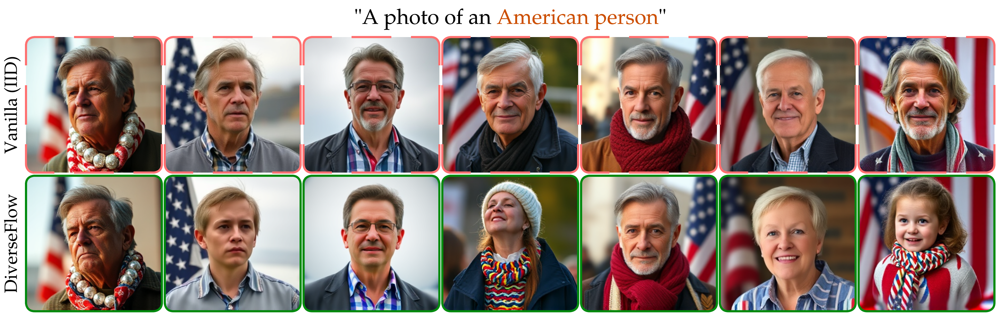

# DiverseFlow

Repository for [*"DiverseFlow: Sample-Efficient Diverse Mode Coverage in Flows"*](https://arxiv.org/pdf/2504.07894).

<!-- header image -->
<p align="center">
  
</p>

## BibTeX

```bib
@inproceedings{morshed2025diverseflow,
  title={DiverseFlow: Sample-Efficient Diverse Mode Coverage in Flows},
  author={Morshed, Mashrur M and Boddeti, Vishnu},
  booktitle={Proceedings of the Computer Vision and Pattern Recognition Conference},
  pages={23303--23312},
  year={2025}
}
```